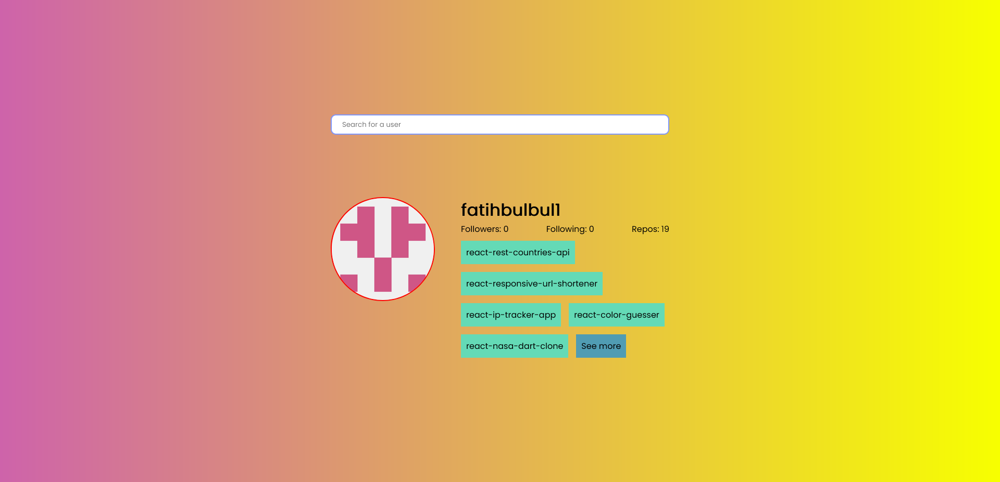
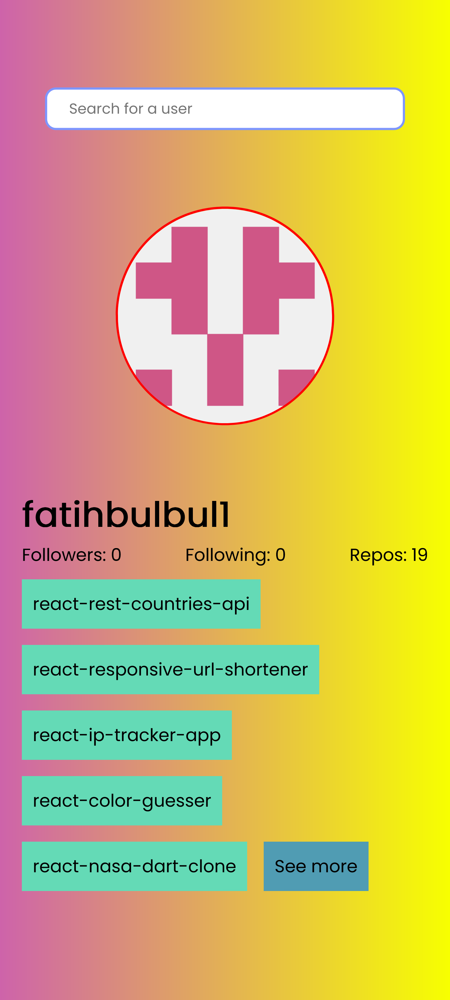

# Github Profile Viewer


Live website: https://fatihbulbul1.github.io/react-github-profile-viewer/


# Overview
Made by:
- **React**
- CSS Flexbox

### Fonts
```css
  @import url('https://fonts.googleapis.com/css2?family=Poppins&display=swap');
  font-family: 'Poppins', sans-serif;
```

## Description 
- Github profile viewer app made by React.
- Search user for followers, following, number of public repos and latest 5 repos information.
- Responsive design.

### Author
- LinkedIn - [Ömer Fatih Bülbül](https://www.linkedin.com/in/ömer-fatih-bülbül-74a890236/)
- Twitter - [fatihbulbul91](https://twitter.com/fatihbulbul91)
